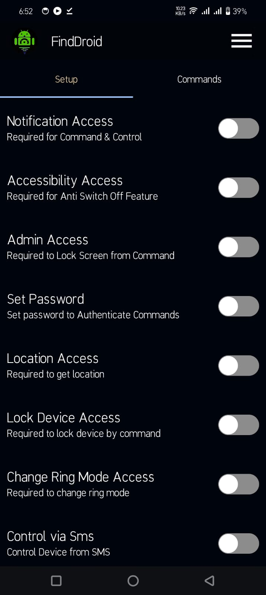
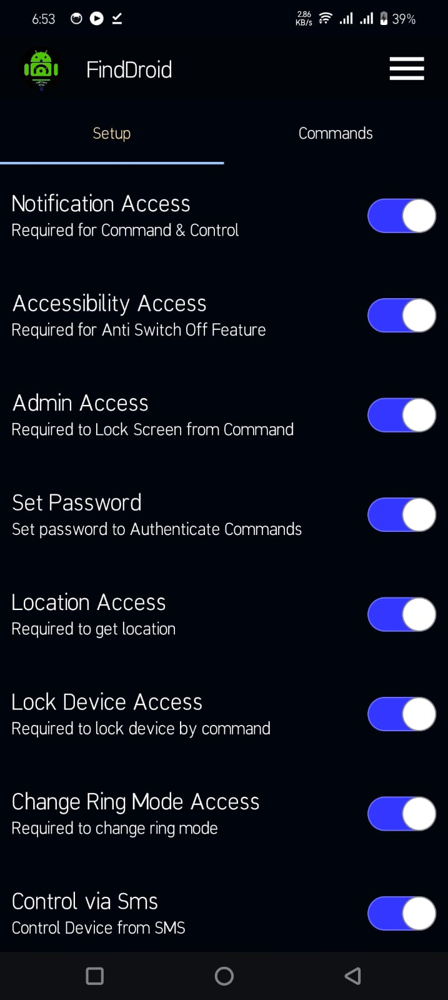
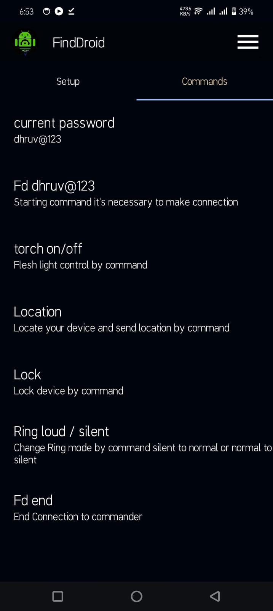
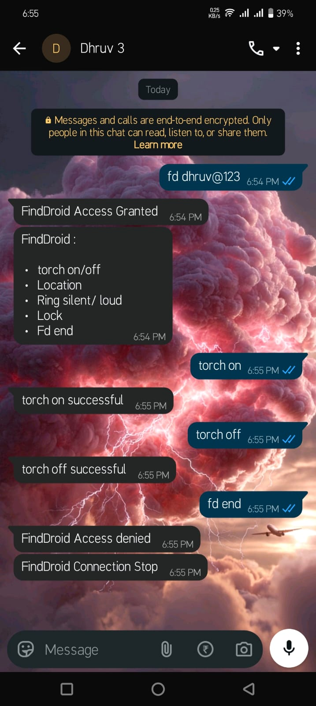

# FindDroid

<p align="center">
  
</p>

<h3 align="center">Find your device. Even when it doesn't want to be found.</h3>

<p align="center">
  <b>FindDroid</b> is an open-source Android device recovery and control application designed to help you locate and manage your device remotely.
</p>

<p align="center">
  <a href="https://finddroid.github.io/">🌐 Website</a> •
  <a href="#download">📥 Download</a> •
  <a href="#features">✨ Features</a> •
  <a href="#building-from-source">🛠️ Build</a> •
  <a href="#contributing">🤝 Contributing</a>
</p>

---

## 📱 About

**FindDroid** is an open-source Android application built to help users recover and control their devices remotely.

The project focuses on providing useful device-recovery features while keeping the application simple and easy to understand.

FindDroid is written in **Java** and built using the **Android SDK**.

---

## ✨ Features

* 📍 **Location Tracking**

  * Retrieve the device's current location.
  * Useful for finding a misplaced device.

* 🔔 **Ring Device**

  * Trigger the device to ring remotely.
  * Designed to help locate a nearby lost device.

* 🔇 **Ring Even When Silent**

  * Allows the device to produce an alert even when normal notification sounds are muted.

* 🔒 **Anti Power-Off**

  * Helps prevent accidental power-off actions while FindDroid protection is enabled.

* 💬 **Remote Commands**

  * Send commands remotely using supported messaging methods.

* 📱 **WhatsApp Support**

  * Control supported FindDroid functions through WhatsApp.

* ✈️ **Telegram Support**

  * Use Telegram to send supported remote commands.

* 💬 **SMS Commands**

  * Perform supported actions through SMS commands.

* 🔐 **Device Administration**

  * Uses Android's device-management capabilities where required by supported features.

---

## 📥 Download

Get the latest FindDroid release from the official website:

<p align="center">
  <a href="https://finddroid.github.io/">
    
  </a>
</p>

### 🌐 Official Website

**https://finddroid.github.io/**

The website contains the latest available APK and additional information about FindDroid.

> Always download FindDroid from the official website or the project's official GitHub repository.

---

## 🖼️ Screenshots

<p align="center">
  
  
  
  
</p>

<p align="center">
  <i>FindDroid Android application</i>
</p>

---

## 🛠️ Tech Stack

| Technology                       | Usage                   |
| -------------------------------- | ----------------------- |
| ☕ Java                           | Application development |
| 🤖 Android SDK                   | Android platform        |
| 📍 Google Play Services Location | Location functionality  |
| 🎨 Material Components           | UI components           |
| 📦 Gradle                        | Build system            |
| 🌐 Volley                        | Network requests        |
| ✨ Lottie                         | Animations              |

---

## 🏗️ Building From Source

### Requirements

* Android Studio
* JDK
* Android SDK
* Git

### Clone the repository

```bash
git clone https://github.com/HuiHola/FindDroid.git
cd FindDroid
```

### Build the project

Open the project in Android Studio and allow Gradle to synchronize.

Then build the APK using:

```bash
./gradlew assembleDebug
```

The generated APK can be found under:

```text
app/build/outputs/apk/debug/
```

### Install on a connected device

Make sure USB debugging is enabled on your Android device and run:

```bash
./gradlew installDebug
```

---

## 🔐 Permissions

FindDroid requires certain Android permissions because some of its features interact with device location, notifications, messaging, and device-management functionality.

Only grant permissions that you understand and that are required for the features you want to use.

Some functionality may also depend on the Android version and device manufacturer.

---

## 🧩 Project Structure

```text
```text
FindDroid/
├── app/
│   ├── src/
│   │   ├── main/
│   │   │   ├── java/
│   │   │   │   └── com/
│   │   │   │       └── hola/
│   │   │   │           └── finddroid/
│   │   │   │               ├── adapters/
│   │   │   │               ├── commands/
│   │   │   │               ├── services/
│   │   │   │               ├── AboutActivity.java
│   │   │   │               ├── MainActivity.java
│   │   │   │               └── ...
│   │   │   │
│   │   │   ├── res/
│   │   │   │   ├── drawable/
│   │   │   │   ├── layout/
│   │   │   │   ├── mipmap-hdpi/
│   │   │   │   ├── mipmap-mdpi/
│   │   │   │   ├── mipmap-xhdpi/
│   │   │   │   ├── mipmap-xxhdpi/
│   │   │   │   ├── mipmap-xxxhdpi/
│   │   │   │   ├── raw/
│   │   │   │   ├── values/
│   │   │   │   └── xml/
│   │   │   │
│   │   │   └── AndroidManifest.xml
│   │   │
│   │   └── test/
│   │       └── java/
│   │           └── com/
│   │               └── hola/
│   │                   └── finddroid/
│   │
│   └── build.gradle.kts
│
├── gradle/
│   ├── libs.versions.toml
│   └── wrapper/
│       ├── gradle-wrapper.jar
│       └── gradle-wrapper.properties
│
├── build.gradle.kts
├── gradle.properties
├── gradlew
├── gradlew.bat
├── settings.gradle.kts
├── README.md
├── LICENSE
└── .gitignore
```
```

---

## 🤝 Contributing

FindDroid is open source and contributions are welcome.

You can contribute by:

* 🐛 Reporting bugs
* 💡 Suggesting features
* 🛠️ Fixing issues
* 🎨 Improving the UI
* 📖 Improving documentation
* 🔐 Reviewing security-related code
* ⚡ Improving performance

### Contribution workflow

1. Fork the repository.
2. Create a new branch.

```bash
git checkout -b feature/my-feature
```

3. Make your changes.
4. Test your changes.
5. Commit them.

```bash
git commit -m "Add my feature"
```

6. Push your branch.

```bash
git push origin feature/my-feature
```

7. Open a Pull Request.

---

## 🐛 Reporting Issues

Found a bug?

Please open an issue and include:

* Android version
* Device model
* FindDroid version
* Steps to reproduce the problem
* Expected behavior
* Actual behavior
* Relevant logs or screenshots

Please **do not post private information, passwords, tokens, API keys, or other secrets** in an issue.

---

## 🔒 Security

Security issues should be reported responsibly.

Please do not publicly disclose sensitive vulnerabilities before they can be investigated and fixed.

If you discover a security issue, contact the project maintainer privately.

---

## 📄 License

FindDroid is open-source software.

See the [`LICENSE`](LICENSE) file for the license and usage terms.

---

## 👨💻 Author

**Dhruv Namdev**

Also known as **HuiHola**

* GitHub: [@HuiHola](https://github.com/HuiHola)
* Website: [findroid.github.io](https://findroid.github.io/)

---

## ⭐ Support the Project

If you find FindDroid useful:

⭐ **Star the repository**

🐛 **Report bugs**

💡 **Suggest improvements**

🤝 **Contribute code**

Sharing the project with other developers also helps the project grow.

---

## ⚠️ Disclaimer

FindDroid is intended to help users manage and recover their own devices.

Use the application only on devices that you own or have explicit permission to manage.

The availability of certain features depends on Android version, device manufacturer, permissions, and system restrictions.

---

<p align="center">
  Made with ☕ and code by <b>HuiHola</b>
</p>

<p align="center">
  <a href="https://finddroid.github.io/">🌐 finddroid.github.io</a>
</p>

